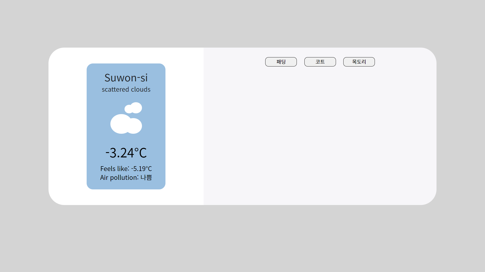
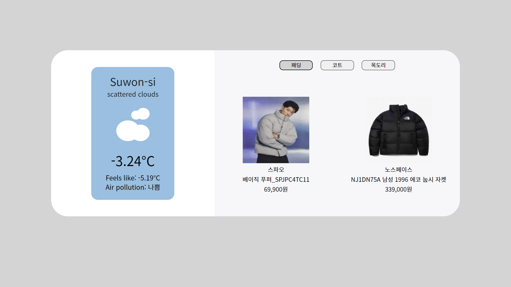
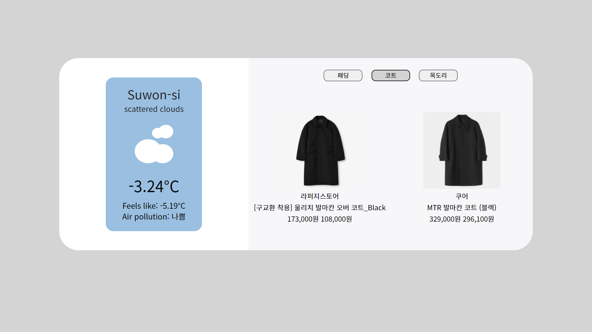
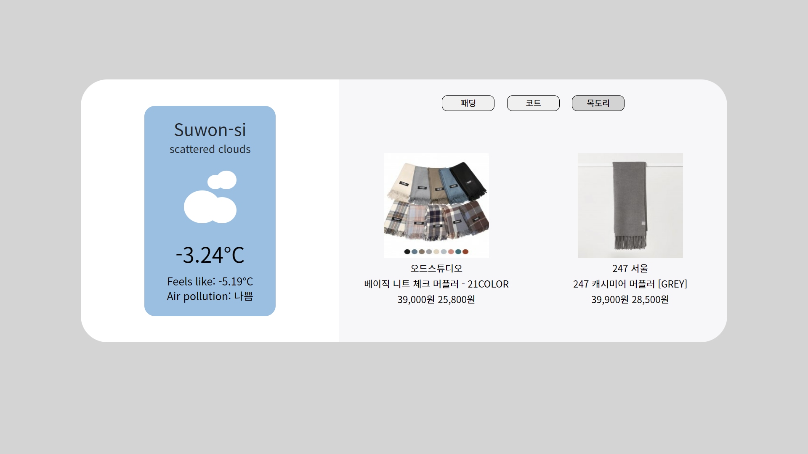

<h1 align="center">
  <br> Moipji <br>
</h1>
<p align="center">
  <strong>실시간 날씨 정보</strong>에 대한 <strong>무신사 옷 추천 서비스</strong>
</p>
<p align="center">
  
 </p>

<p align="center">
  <a href="#Description">Description</a> •
  <a href="#Usage">Usage</a> •
  <a href="#Credits">Credits</a> •
  <a href="#other-documents">Other Documents</a> •
  <a href="#Contact">Contact</a>
</p>


## Description


### Features
 * 실시간 날씨 정보
 * 추천 옷 종류 (ex. 4℃ 이하일 때 => 패딩, 코트, 목도리)
 * 무신사 랭킹 1위인 제품에 대한 정보
    * 브랜드
    * 제품명
    * 가격
    * 사진
    
 ### Screenshot

<p align="left">
  
  
  
  
  
 </p>

### Demo

[발표 영상](https://youtu.be/QxnX_vPNGvQ)

## Usage


### Prerequistes

- ejs ^3.1.8
- express ^4.18.2
- request ^2.88.2

### Requirements

Please make your own conf.JSON in /conf/conf.JSON

```shell
// conf.JSON
{
  "SERVICE_KEY": "[YOUR API KEY]"
}
```
API_KEY can be obtained at [Open Weather Map](https://api.openweathermap.org/data/2.5/weather").

```shell
# Clone this repository 
$ git clone https://github.com/minji-dev/OSS_team12.git

# Go into the repository
$ cd OSS_team12

# Install Packages
$ npm install

# Install additional Packages
$ npm install request
$ npm install -g nodemon

# Start server
$ npm start
```

After start server, You will then be able to access it at
[`http://localhost:3000`](http://localhost:3000)


## Credits

- [`Node.js`](https://nodejs.org/ko/)
- [`Express`](https://expressjs.com/ko/)


## Other Documents

### 폴더 구조
+ /public: 
  + 외부에서 접근 가능한 파일들
+ /routes: 
  + 라우팅을 위한 폴더, 클라이언트에서 날씨 api, 무신사 웹크롤링 request 요청 시 수행하는 파일
+ /views: 
  + request 요청에 대한 logic을 처리한 후 클라이언트에 응답을 보낼 때 ejs 코드로 변환해서 반환하는 파일들
 
  

## Contact
***
||
---|---|---
[Minji park](https://www.notion.so/Minji-Park-4579714c69cd41e992e4c0425170ba76)|[Junemo Kang](https://github.com/peter0107)|[Jihak Lee](https://github.com/LsaaIee)


---

우수 프로젝트 시상 프로그램에 지원합니다.
